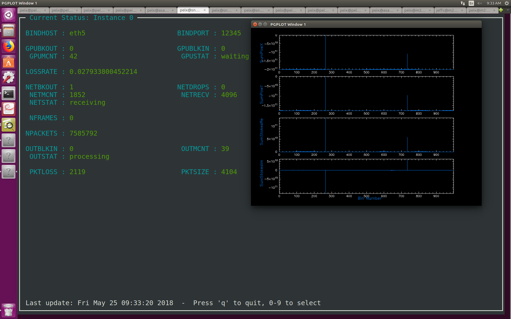

# demo4_hashpipe
In this tutorial, a new method will be used in net thread for high speed packets receiving (>= 5Gbps). The GPU thread and output thread are the same as in demo3,  perform PFB,FFT,Correlation and Accumulation, and write the output data to a filterbank file.

First, you can download and install this demo through following step:
```javascript
git clone https://github.com/SparkePei/demo4_hashpipe.git
cd demo4_hashpipe
make
```
And then,you can open your Hashpipe instance by:
```javascript
./demo4_init.sh
```
However, you need to set up your own hardware to send test packets. In here, we use ROACH2 to generate packets and send them to a GPU server through 10Gb link.

Three threads will be opened for packets receiving, GPU processing and filterbank data writing.

In net thread, you can generally use udp protocol to receive the packets like we did in demo3. However, the OS task wants create Transport,Network and Data Link layer headers for each packet, and the CPU might not be happy with that when the data rate goes up. What we did in here is that we use RAW socket instead of UDP socket, which allows you to bypass the TCP/UDP layer (Layer 4) in the RtxTcpIp stack and communicate directly with the Network IP layer (Layer 3). This functionality allows you to skip the addition of TCP/UDP protocols to your frames and, optionally, provide a comparable protocol of your own.
To create a raw socket, the type field should be set to SOCK_RAW and the protocol field should be ETH_P_IP.
Use PF_PACKET if you want to send and receive messages at the most basic level, below the Internet protocol layer, for example because you are implementing the protocol yourself.  This is a very advanced option. You can do it like this:
```javascript
socket(PF_PACKET, SOCK_RAW, htons(ETH_P_IP));
```
There are some functions in hashpipe to open and receive the packets:
```javascript
hashpipe_pktsock_open(p_ps, bindhost, PACKET_RX_RING);
hashpipe_pktsock_recv_udp_frame_nonblock(p_ps, bindport);
```
If you want to open multicast receiving mode. You need to do this (demo4 doesn't has this function, but we did it in [in here.](https://github.com/SparkePei/FAST_hashpipe)):
```javascript
struct ip_mreq mreq;
mreq.imr_multiaddr.s_addr = inet_addr(frb_group);
mreq.imr_interface.s_addr = inet_addr("192.168.16.11");
if (setsockopt(up.sock, IPPROTO_IP, IP_ADD_MEMBERSHIP, &mreq,sizeof(mreq)) < 0) {
    hashpipe_error("FAST_net_thread", "Error joining multicast group.");
    pthread_exit(NULL);
    }
```
You can interact with Hashpipe by add option -o through Store K=V in status buffer, so we can give the socket an address in command line like this:
```javascript
hashpipe -p ./demo4_hashpipe -I 0 -o BINDHOST="192.168.0.1"
```
A plot of Full-Stokes will be shown simutaneously, Fig. 1 shows how does demo4 looks like.

> Fig. 1 demo4's screen capture

The GPU code of this demo is from CASPER tutorial 5, which was written by Mark Wagner and Jayanth Chennamangalam.You can find it [in here.](https://casper.berkeley.edu/wiki/Tutorial_5:_Heterogeneous_Instrumentation)
### NUMA setting
Non-uniform memory access (NUMA) systems are server platforms with more than one system bus. These platforms can utilize multiple processors on a single motherboard, and all processors can access all the memory on the board. When a processor accesses memory that does not lie within its own node (remote memory), data must be transferred over the NUMA connection at a rate that is slower than it would be when accessing local memory. Thus, memory access times are not uniform and depend on the location (proximity) of the memory and the node from which it is accessed.
You can execute ./prtopology_pnn.sh to print out the NUMA topology of your server. Following is the output from our GPU server:
```javascript
Sockets/cores to CPUs:
socket 0, core  0 -> cpu  0
socket 0, core  0 -> cpu 12
socket 0, core  1 -> cpu  1
socket 0, core  1 -> cpu 13
socket 0, core  2 -> cpu  2
socket 0, core  2 -> cpu 14
socket 0, core  3 -> cpu  3
socket 0, core  3 -> cpu 15
socket 0, core  4 -> cpu  4
socket 0, core  4 -> cpu 16
socket 0, core  5 -> cpu  5
socket 0, core  5 -> cpu 17
socket 1, core  0 -> cpu  6
socket 1, core  0 -> cpu 18
socket 1, core  1 -> cpu  7
socket 1, core  1 -> cpu 19
socket 1, core  2 -> cpu  8
socket 1, core  2 -> cpu 20
socket 1, core  3 -> cpu  9
socket 1, core  3 -> cpu 21
socket 1, core  4 -> cpu 10
socket 1, core  4 -> cpu 22
socket 1, core  5 -> cpu 11
socket 1, core  5 -> cpu 23

Ethernet interfaces to CPUs:
eth0: 0-5,12-17
eth1: 0-5,12-17
eth2: 0-5,12-17
eth3: 0-5,12-17
eth4: 6-11,18-23
eth5: 6-11,18-23

GPUs to CPUs:
gpu0000:83:00.0: 6-11,18-23
```
On this machine, we have 2 NUMA nodes named with socket 0 and 1, socket 0 has 6 dual cores which includes cpu 0-5 and 12-17, socket 1 includes cpu 6-11 and 18-23. There are 5 Ethernet interfaces on this machine, and the relationships with cpus are shown in the second part. There is one GPU on this machine can access from cpu 6-11 and 18-23 directly.
In Hashpipe, we can bind and unbind(also known as mask) a process or a thread to a CPU or a range of CPUs, so that the process or thread will execute only on the designated CPU or CPUs rather than any CPU.
To do this, you can use -c option to assign a particular cpu to a thread:
```javascript
-c 18 demo4_net_thread -c 19 demo4_gpu_thread -c 20 demo4_output_thread
```
#### IRQ Processor Affinity
System throughput is often improved by isolating the handling of high volume interrupt requests (IRQs) to a single processor in an SMP host. This isolation is called processor affinity. It is particularly important to do this if you have created processor affinity for any or all of the data acquisition threads. For one of these threads to be removed from a processor by an IRQ, with nowhere else to execute, can degrade system throughput. A common system modification for running Hashpipe is to create a processor affinity for the ethernet interface that communicates with the hardware(ROACH2 board), as this interface is typically responsible for a high volume of IRQs. This is an example used here. 
First we need to know the IRQ number. Suppose that the ROACH2 facing ethernet port is eth5. In order to determine the IRQ number for eth5 run:
```javascript
cat /proc/interrupts | grep eth5
```
The first column in the output is the IRQ number. On the reference system, this was IRQ 257. To determine the current processor affinity (if any) for IRQ 257: 
```javascript
cat /proc/irq/257/smp_affinity
```
The output indicates current affinity as a boolean bit field. It is given in hexadecimal, with the rightmost digit being the least significant, ie the booleans for the 4 lowest numbered processors. A binary 1 means that the processor is enabled to handle this IRQ, while a 0 means that it is not. If the low order 6 hexadecimal digits on a 24 processor machine read is: ffffff. Then all processors are enabled to handle this IRQ, ie there is no affinity. If we want to isolate this IRQ to cpu 23, for example, we would do: 
```javascript
echo 008000 > /proc/irq/257/smp_affinity
cat /proc/irq/257/smp_affinity
```
The low order digits should now read is: 800000. At this point, IRQ 257 will be handled only by CPU 23. This will take effect with the next interrupt.
Note that this will not survive a reboot. In order to have processor affinity set as you would like it on the next boot, place the echo command in a boot script.
It is recommended that you disable irqbalance if you are setting your own processor affinity for IRQs. 

